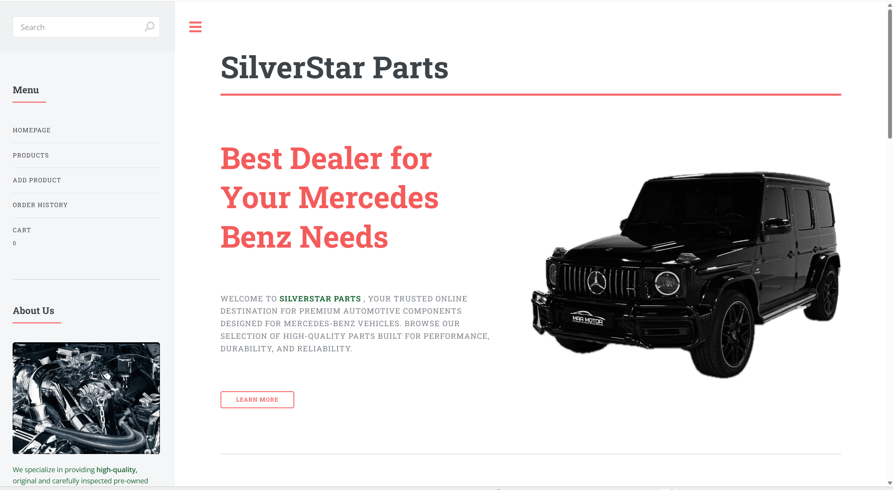
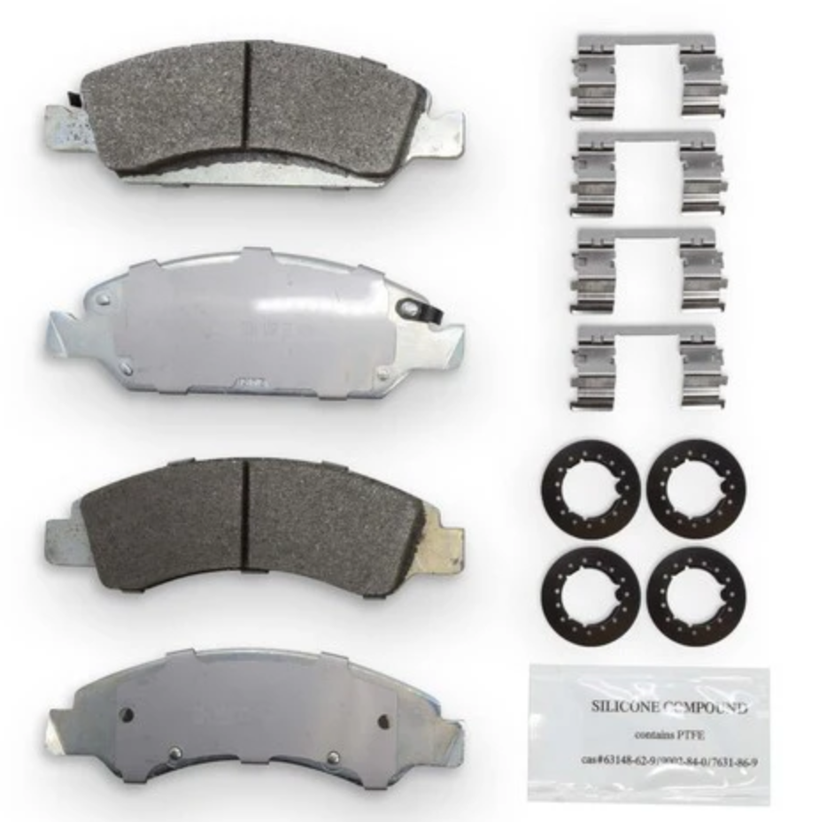
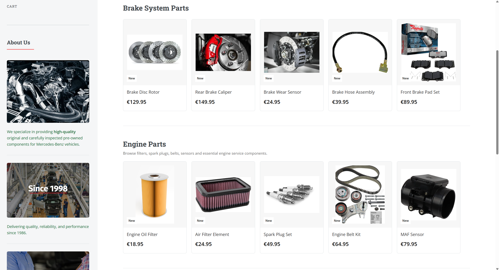
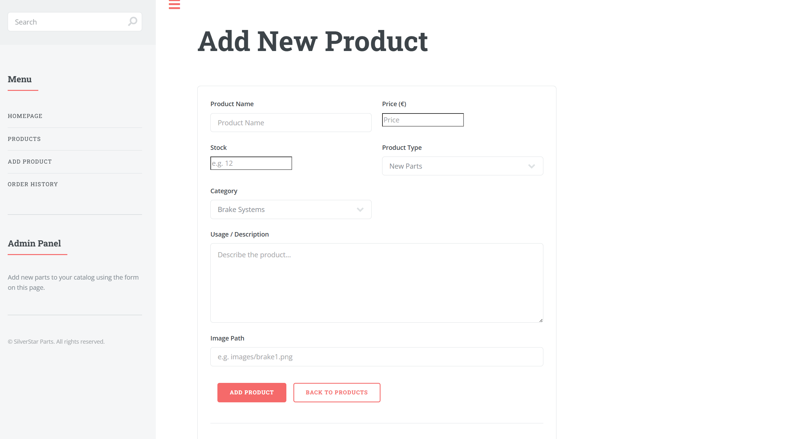
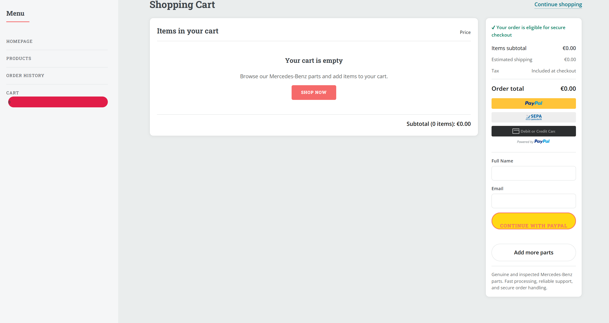
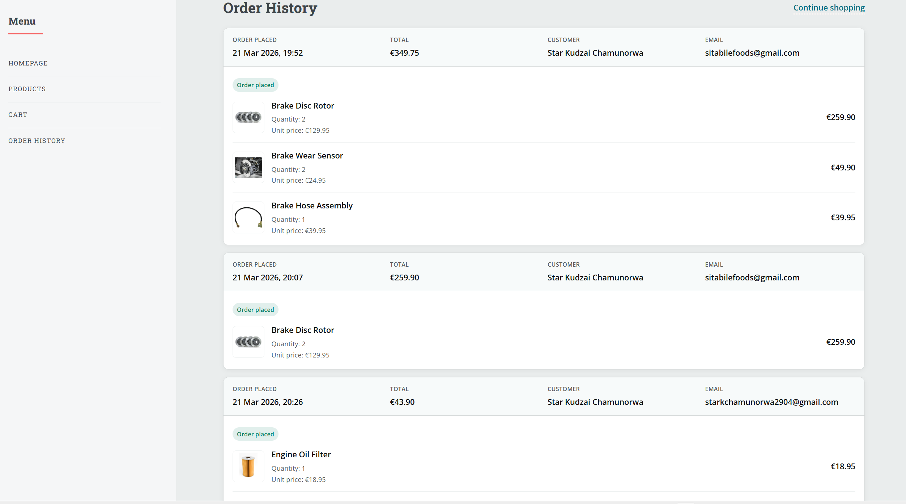

# Mercedes Benz Car Parts Hub - SilverStar

## Project Overview

**Mercedes Benz Car Parts Hub - SilverStar** is a full-stack e-commerce web application developed for selling Mercedes Benz car parts online. The platform allows users to browse available parts, search for products, view detailed product information, add new products, simulate payments using PayPal Sandbox, and review order history: The system demonstrates both front-end and back-end development concepts, including RESTful API design, database integration, and payment simulation. 

---

## Company Name

**SilverStar**

---

## Project Objectives

The main objective of this project is to build a simple and functional online shop for Mercedes Benz car parts. The application was designed to meet the following requirements:

- Create an attractive landing page for the company
- Display all products in a product listing page
- Allow users to click products to view more details
- Provide functionality to add a new product
- Enable product search by name
- Simulate online payments using PayPal Sandbox
- Store and display order history


---

## Features

- Responsive landing page
- Product listing page
- Product details page
- Add new product page
- Search products by name
- PayPal Sandbox payment integration
- Order history page
- REST API for products and orders
- MongoDB database integration

---

## Tech Stack

### Frontend
- HTML
- CSS
- JavaScript
- SCSS


### Backend
- Node.js
- Express.js

### Database
- MongoDB
- Mongoose

### Payment Integration
- PayPal Sandbox

### Version Control
- Git and GitHub

---


##  How to Run the Project

To run the SilverStar Parts Hub application locally, follow the steps below:

1. Install the required software:
   - Node.js (version 18 or higher recommended)
   - MongoDB (local installation or MongoDB Atlas)
   - Git (optional)

2. Download or clone the project files and navigate to the project folder.

3. Install backend dependencies by running:
   - `npm install`

4. Create a `.env` file in the root directory and add the following variables:
   - `PORT=5000`
   - `MONGO_URI=your_mongodb_connection_string`
   - `PAYPAL_CLIENT_ID=your_paypal_client_id`
   - `PAYPAL_CLIENT_SECRET=your_paypal_client_secret`

5. Create PayPal Sandbox accounts:
   - Create one **Personal account (buyer)**
   - Create one **Business account (merchant)**
   - Both accounts should be created using **United States (US)** as the region
   - This is required because PayPal Sandbox enforces **USD currency** due to regional payment regulations
   - Euro (€) currency is not supported in this project configuration

6. Start the backend server by running:
   - `npm start`
   - or `npm run dev` (if nodemon is installed)

7. Ensure MongoDB is running and connected successfully.

8. Open the frontend by launching:
   - `index.html`
   - or run a local server using `npx serve`

9. Access the application in your browser.

10. Add sample products using the Add Product page.

11. Browse products, add items to the cart, and proceed to checkout.

12. Complete the payment using PayPal Sandbox credentials (US personal account).

13. After successful payment, view orders in the Order History page.

Following these steps will run the SilverStar Parts Hub application locally with full functionality.

---


## Landing Page

The landing page is the first page users see when they open the SilverStar Parts Hub website. Its purpose is to introduce the company, present the brand identity, and guide users toward browsing Mercedes-Benz car parts.  

For this page, I used the **Editorial template by HTML5 UP** as the base layout and then customized it to fit the project theme, branding, images, navigation, and content related to Mercedes-Benz parts. The template provided a responsive structure, while the project-specific modifications focused on creating a professional e-commerce landing page for **SilverStar Parts**.

### Template Used

- **Template Name:** Editorial
- **Source:** HTML5 UP
- **Purpose of using template:** To provide a responsive and modern UI foundation which I then adapted for my own e-commerce project.

---

### 1. Basic Page Structure

The landing page begins with the standard HTML document structure. It also links the external stylesheet from the template.



```html
<!DOCTYPE HTML>
<html>
	<head>
		<title>SilverStar Parts</title>
		<meta charset="utf-8" />
		<meta name="viewport" content="width=device-width, initial-scale=1, user-scalable=no" />
		<link rel="stylesheet" href="assets/css/main.css" />
	</head>
	<body class="is-preload">

```

### 2. Wrapper and Main Layout

The template organizes the page using a wrapper, a main content area, and a sidebar.

```html
<div id="wrapper">

	<div id="main">
		<div class="inner">

```

**Explanation**

* `wrapper` contains entire layout
* `main` contains page content
* `inner` provides spacing and alignment

---

### 3.Original Parts Section

This section presents the first main product category: original Mercedes-Benz parts.

```html
<section id="original-parts">
	<header class="major">
		<h2>Original Parts</h2>
	</header>
	<div class="original-intro">
		<p>
			We provide a wide range of genuine and high-quality original car parts designed to ensure reliability, safety, and optimal vehicle performance. Our products come from trusted manufacturers and meet the highest industry standards to keep your vehicle running smoothly.
		</p>
	</div>

```

**Explanation**

* Presents genuine Mercedes Benz parts
* Builds trust with customers
* Linked from banner "Learn More" button

---

### 4.Feature Cards for Original Parts

Inside the original parts section, feature cards are used to present different product categories.

Example: Brake System Components

```html
<article>
	<span class="icon part-icon">
		
	</span>
	<div class="content">
		<h3>Brake System Components</h3>
		<p>Our brake system components are designed to ensure maximum safety, reliability, and stopping performance for your vehicle. At SilverStar Parts, we supply high-quality brake pads, brake discs, calipers, sensors, and related components that meet strict automotive standards. Each product is selected to provide consistent braking efficiency, durability, and optimal performance, helping drivers maintain full control and confidence on the road.Example parts we offer:
			<ul>
				<li>Brake pads</li>
				<li>Brake discs</li>
				<li>Brake calipers</li>
				<li>Brake sensors</li>
			</ul>
		</p>
	</div>
</article>

```

**Explanation**

* Each article represents product category
* Image used as icon
* Title describes part category
* List shows example products
* Card layout improves readability

---


### 5.Pre-Owned Parts Section

The pre-owned section promotes budget-friendly used Mercedes-Benz parts.

```html
<section class="preowned-section">
	<header class="major">
		<h2>Pre-owned Car Parts</h2>
	</header>

	<div class="preowned-banner">
		<div class="preowned-banner-text">
			<h2>Quality Parts That Fit Your Budget</h2>
			<p>
				At SilverStar Parts, we offer carefully inspected pre-owned Mercedes-Benz components for customers who want dependable performance at a lower cost.
			</p>
			<a href="#preowned-items" class="preowned-link">Explore Pre-Owned Parts →</a>
		</div>

		<div class="preowned-banner-images">
			
			
		</div>
	</div>

```

**Explanation**

* Shows affordable alternative parts
* Helps budget-conscious customers
* Separate section improves organization

---


### 6.Sidebar Search Bar

The sidebar includes a search field that supports the product search functionality of the project.

The search field allows users to enter a keyword when looking for a product.
It is placed in the sidebar so that it remains easily accessible.
The input field is part of the user interface and can later be connected to backend product search logic.
Including search functionality is important because it improves usability in an e-commerce system.

```html
<section id="search" class="alt">
	<form method="post" action="#">
		<input type="text" name="query" id="query" placeholder="Search" />
	</form>
</section>

```

---

### 8. Navigation Menu

```html
<nav id="menu">
    <ul>
        <li><a href="index.html">Homepage</a></li>
        <li><a href="generic.html">Products</a></li>
        <li><a href="addproduct.html">Add Product</a></li>
        <li><a href="orderhistory.html">Order History</a></li>
        <li>
            <a href="cart.html">
                Cart
                <span id="cartCountBadge">0</span>
            </a>
        </li>
    </ul>
</nav>
```

**Explanation**

* Provides navigation to main pages
* Includes cart link
* Cart badge displays item count

---

### 9. Search Bar

```html
<input type="text" name="query" id="query" placeholder="Search" />
```

**Explanation**

* Allows users to search products
* Improves usability
* Can be connected to backend search

---

### 10. Cart Badge JavaScript

```javascript
function updateCartBadge() {
  const badge = document.getElementById("cartCountBadge");
  if (!badge) return;

  const cart = JSON.parse(localStorage.getItem("cart")) || [];

  let count = 0;
  cart.forEach(item => {
    count += Number(item.quantity || 1);
  });

  badge.textContent = count;
}

updateCartBadge();
window.updateCartBadge = updateCartBadge;
```

**Explanation**

* Retrieves cart from localStorage
* Calculates total items
* Updates cart badge
* Improves shopping experience

---

### Landing Page Summary

The landing page was customized from the HTML5 UP Editorial template.
It introduces the SilverStar Parts brand, displays original and pre-owned Mercedes Benz components, and provides navigation to the rest of the application.
The page also includes search functionality and a dynamic cart badge to improve usability.


---


## System Architecture

The application follows a typical full-stack web application structure:

- **Frontend** handles the user interface and user interaction
- **Backend** handles API requests, business logic, and communication with the database
- **MongoDB** stores product and order data
- **PayPal Sandbox** simulates the payment process

---

## Products Page

The Products page allows users to browse available Mercedes-Benz car parts, filter by category, search products, view product details, and add items to the cart. This page was built using the **HTML5 UP Editorial template** and extended with custom CSS and JavaScript to support dynamic functionality.



---

## Page Structure

```html
<!DOCTYPE HTML>
<html>
<head>
	<title>Our Products - By SilverStar Parts</title>
	<meta charset="utf-8" />
	<meta name="viewport" content="width=device-width, initial-scale=1, user-scalable=no" />
	<link rel="stylesheet" href="assets/css/main.css" />
</head>
```

### Explanation

* Defines HTML5 document
* Sets responsive viewport
* Links template stylesheet
* Customizes page title

---

## Page Header

```html
<header class="main">
	<h1>Explore our products</h1>
</header>
```

### Explanation

* Displays page heading
* Introduces product browsing section

---

## Product Group Tabs

```html
<div class="parts-tabs">
	<button class="parts-tab active" data-group="new-parts">New Parts</button>
	<button class="parts-tab" data-group="preowned-parts">Pre-Owned Parts</button>
	<button class="parts-tab" data-group="all-parts">View All</button>
</div>
```

### Explanation

* Allows switching between product groups
* Uses `data-group` attribute for filtering
* Improves navigation

---

## Category Navigation Tabs

```html
<div class="category-tabs">
	<a href="#brakes" class="tab active">Brake Systems</a>
	<a href="#engine" class="tab">Engine Parts</a>
	<a href="#electrical" class="tab">Electrical</a>
	<a href="#lighting" class="tab">Lighting Systems</a>
</div>
```

### Explanation

* Provides category navigation
* Scrolls to specific product sections
* Improves usability

---

## Product Panel Structure

```html
<section id="brakes" class="products-panel">
	<h2>Brake System Parts</h2>
	<div class="products-row"></div>
</section>
```

### Explanation

* Each category has its own panel
* `products-row` used for dynamic product insertion
* JavaScript populates this container

---

## Search Field

```html
<input type="text" name="query" id="query" placeholder="Search" />
```

### Explanation

* Allows product search
* Connected to JavaScript filtering
* Filters products in real-time

---

## Product Modal

```html
<div id="productModal" class="product-modal">
	<div class="product-modal-content">
		<button id="closeProductModal" class="close-modal">&times;</button>

		<div class="product-modal-body">
			<div class="product-modal-image">
				
			</div>

			<div class="product-modal-details">
				<h2 id="modalProductName"></h2>
				<p id="modalProductStock"></p>
				<p id="modalProductUse"></p>
				<h3 id="modalProductPrice"></h3>
			</div>
		</div>
	</div>
</div>
```

### Explanation

* Displays product details
* Opens when product clicked
* Shows image, stock, description, price

---

## Quantity and Add to Cart

```html
<div class="cart-actions">
	<input type="number" id="quantityInput" min="1" value="1" />
	<button id="addToCartBtn" class="button primary">
		Add to Cart
	</button>
</div>
```

### Explanation

* Allows quantity selection
* Adds product to cart
* Improves user interaction

---

## Load Products from API

```javascript
async function loadProducts() {
	const res = await fetch("/api/products");
	const products = await res.json();

	products.forEach((p) => {
		const target = getTargetRow(p);
		if (target) target.appendChild(createProductCard(p));
	});
}
```

### Explanation

* Fetches products from backend
* Converts response to JSON
* Dynamically renders product cards
* Populates correct category

---

## Search Functionality

```javascript
queryInput.addEventListener("input", function () {
	const value = this.value.toLowerCase();

	document.querySelectorAll(".product-card").forEach(card => {
		const name = card.textContent.toLowerCase();
		card.style.display = name.includes(value) ? "" : "none";
	});
});
```

### Explanation

* Listens to search input
* Filters product cards
* Displays matching results
* Hides non-matching items

---

## Product Modal Script

```javascript
document.addEventListener("click", function (e) {
	const item = e.target.closest(".product-trigger");
	if (!item) return;

	modal.classList.add("active");
});
```

### Explanation

* Detects product click
* Opens modal window
* Displays product details

---

## Add to Cart Logic

```javascript
addToCartBtn.addEventListener("click", function () {
	const cart = JSON.parse(localStorage.getItem("cart")) || [];
	cart.push({
		name: this.dataset.name,
		price: this.dataset.price
	});
	localStorage.setItem("cart", JSON.stringify(cart));
});
```

### Explanation

* Reads cart from localStorage
* Adds selected product
* Saves updated cart
* Enables persistent shopping cart

---

## Cart Toast Notification

```html
<div id="cartToast" class="cart-toast">
	✔ Added to cart
</div>
```

### Explanation

* Displays confirmation message
* Appears after adding item to cart
* Improves user feedback

---

## Summary

The Products page provides:

* Product listing
* Category filtering
* Search functionality
* Modal product view
* Add to cart feature
* Dynamic data loading
* Cart notifications

This page connects the frontend interface with backend product APIs, forming the core shopping functionality of the SilverStar Parts Hub.

---

## Add Product Page

The Add Product page is an administrative page in the **SilverStar Parts Hub** project. Its purpose is to allow the user or administrator to add new Mercedes-Benz parts to the product catalog and delete existing products from the system. This page connects the frontend form interface with the backend API using JavaScript and the `fetch()` function.

Like the other pages in this project, the Add Product page uses the **HTML5 UP Editorial template** as the base layout and structure, while the form logic and product management functionality were customized for the project requirements.



---

## Basic Page Structure

```html
<!DOCTYPE HTML>
<html>
<head>
  <title>Add Product - SilverStar Parts</title>
  <meta charset="utf-8" />
  <meta name="viewport" content="width=device-width, initial-scale=1, user-scalable=no" />
  <link rel="stylesheet" href="assets/css/main.css" />
</head>
```

### Explanation

* Defines the file as an HTML5 document.
* Sets the page title to **Add Product - SilverStar Parts**.
* Uses the viewport meta tag to make the page responsive on different screen sizes.
* Links the main stylesheet from the HTML5 UP template.

---

## Main Layout Structure

```html
<body class="add-product-page">
  <div id="wrapper">

    <div id="main">
      <div class="inner">
```

### Explanation

* The `body` uses a specific class for page-level styling.
* `wrapper` contains the full page layout.
* `main` holds the central content of the page.
* `inner` applies spacing and alignment based on the template structure.

---

## Page Header

```html
<section>
  <header class="main">
    <h1>Add New Product</h1>
  </header>
```

### Explanation

* Displays the title of the page.
* Clearly tells the user that this page is used to add products to the catalog.
* Acts as the main heading for the administrative product management section.

---

## Add Product Form Container

```html
<div class="add-product-card">
  <form id="productForm" class="add-product-form">
    <div class="row gtr-uniform">
```

### Explanation

* `add-product-card` is used to visually group the form inside a styled card.
* `productForm` is the main form used for adding new products.
* `row gtr-uniform` comes from the template grid system and helps arrange the input fields neatly.

---

## Product Name Field

```html
<div class="col-6 col-12-small">
  <label for="name">Product Name</label>
  <input type="text" id="name" name="name" placeholder="Product Name" required />
</div>
```

### Explanation

* This input field is used to enter the product name.
* The `required` attribute ensures the field cannot be left empty.
* The label improves accessibility and clarity for the user.

---

## Price Field

```html
<div class="col-6 col-12-small">
  <label for="price">Price (€)</label>
  <input type="number" id="price" name="price" min="0" step="0.01" placeholder="Price" required />
</div>
```

### Explanation

* This field collects the price of the product.
* `type="number"` ensures only numerical values are entered.
* `min="0"` prevents negative prices.
* `step="0.01"` allows decimal values such as `49.99`.

---

## Stock Field

```html
<div class="col-6 col-12-small">
  <label for="stock">Stock</label>
  <input type="number" id="stock" name="stock" min="0" step="1" placeholder="e.g. 12" required />
</div>
```

### Explanation

* This field records the quantity of the product in stock.
* Only whole numbers are expected because stock represents item count.
* The `required` attribute ensures the product cannot be submitted without stock information.

---

## Product Type Field

```html
<div class="col-6 col-12-small">
  <label for="group">Product Type</label>
  <select id="group" name="group" required>
    <option value="new">New Parts</option>
    <option value="preowned">Pre-Owned Parts</option>
  </select>
</div>
```

### Explanation

* This dropdown allows the user to choose whether the product is new or pre-owned.
* It helps classify products correctly on the products page.
* The selected value is later stored as the `condition` field in the JavaScript product object.

---

## Category Field

```html
<div class="col-6 col-12-small">
  <label for="category">Category</label>
  <select id="category" name="category" required>
    <option value="brakes">Brake Systems</option>
    <option value="engine">Engine Parts</option>
    <option value="electrical">Electrical</option>
    <option value="lighting">Lighting Systems</option>
    <option value="other">Other Parts</option>
  </select>
</div>
```

### Explanation

* This field assigns the product to a specific category.
* Categories are important because the products page displays products in separate sections.
* This allows the backend data and the frontend layout to work together correctly.

---

## Description Field

```html
<div class="col-12">
  <label for="use">Usage / Description</label>
  <textarea id="use" name="use" placeholder="Describe the product..." rows="6" required></textarea>
</div>
```

### Explanation

* This field stores the product description.
* It is used to explain the function, use, or details of the product.
* The description later appears in the product modal and helps the user understand the item before purchasing.

---

## Image Path Field

```html
<div class="col-12">
  <label for="image">Image Path</label>
  <input type="text" id="image" name="image" placeholder="e.g. images/brake1.png" />
</div>
```

### Explanation

* This field allows the user to provide the image path for the product.
* If no image is entered, the JavaScript code uses a default image.
* This makes the form more flexible and prevents missing image errors.

---

## Submit and Navigation Buttons

```html
<div class="col-12">
  <ul class="actions">
    <li><button type="submit" class="primary">Add Product</button></li>
    <li><a href="generic.html" class="button">Back to Products</a></li>
  </ul>
</div>
```

### Explanation

* The **Add Product** button submits the form data to the backend.
* The **Back to Products** button allows the user to return to the products page.
* These controls improve usability by combining form submission and quick navigation.

---

## Delete Product Section

```html
<hr class="major" />

<div class="delete-product-box">
  <h2>Delete Product</h2>
  <form id="deleteProductForm" class="add-product-form">
    <div class="row gtr-uniform">
      <div class="col-12">
        <label for="deleteName">Product Name</label>
        <input type="text" id="deleteName" name="deleteName" placeholder="Enter exact product name" required />
      </div>

      <div class="col-12">
        <ul class="actions">
          <li><button type="submit" class="button">Delete Product</button></li>
        </ul>
      </div>
    </div>
  </form>
</div>
```

### Explanation

* This section provides functionality to remove a product from the catalog.
* The user enters the exact product name.
* JavaScript then searches for the product and sends a delete request to the backend.
* Combining add and delete functions on one page makes product management more efficient.

---

## Message Output Area

```html
<p id="productMessage" class="product-message" style="display:none;"></p>
```

### Explanation

* This paragraph is used to display success or error messages.
* It is hidden by default and only appears after an action is performed.
* This gives immediate feedback to the user after adding or deleting a product.

---

## Sidebar Search

```html
<section id="search" class="alt">
  <form onsubmit="return false;">
    <input type="text" name="query" id="query" placeholder="Search" />
  </form>
</section>
```

### Explanation

* This search field is included in the sidebar layout.
* It matches the structure used on the other pages for consistency.
* `onsubmit="return false;"` prevents the page from reloading when the form is used.

---

## Sidebar Menu

```html
<nav id="menu">
  <header class="major">
    <h2>Menu</h2>
  </header>
  <ul>
    <li><a href="index.html">Homepage</a></li>
    <li><a href="generic.html">Products</a></li>
    <li><a href="addproduct.html">Add Product</a></li>
    <li><a href="orderhistory.html">Order History</a></li>
  </ul>
</nav>
```

### Explanation

* This menu provides navigation to the main sections of the system.
* It allows the administrator to move between pages without needing to type URLs manually.
* Using the same sidebar structure across multiple pages improves design consistency.

---

## Admin Panel Section

```html
<section>
  <header class="major">
    <h2>Admin Panel</h2>
  </header>
  <p>Add new parts to your catalog using the form on this page.</p>
</section>
```

### Explanation

* This section identifies the page as part of the administrative area of the application.
* It gives a short explanation of the page purpose.
* This is useful because the Add Product page is intended for product management rather than customer browsing.

---

## External JavaScript Files

```html
<script src="assets/js/jquery.min.js"></script>
<script src="assets/js/browser.min.js"></script>
<script src="assets/js/breakpoints.min.js"></script>
<script src="assets/js/util.js"></script>
<script src="assets/js/main.js"></script>
```

### Explanation

* These files come from the HTML5 UP template.
* They support responsive behavior, layout adjustments, and general UI interactions.
* Keeping these files separate helps organize the project and reuse the template features.

---

## DOMContentLoaded Event

```javascript
document.addEventListener("DOMContentLoaded", () => {
  const form = document.getElementById("productForm");
  const deleteForm = document.getElementById("deleteProductForm");
  const msg = document.getElementById("productMessage");
```

### Explanation

* The script waits until the HTML document is fully loaded before running.
* It stores references to:

  * the add product form
  * the delete product form
  * the message area
* This ensures the JavaScript only runs after the page elements are available.

---

## Message Display Function

```javascript
function showMessage(text, isError = false) {
  msg.textContent = text;
  msg.style.display = "block";
  msg.style.color = isError ? "red" : "green";
}
```

### Explanation

* This function displays feedback messages to the user.
* If `isError` is `true`, the message appears in red.
* Otherwise, the message appears in green.
* This helps the user immediately understand whether the action succeeded or failed.

---

## Creating the Product Object

```javascript
const product = {
  name: document.getElementById("name").value.trim(),
  price: Number(document.getElementById("price").value),
  stock: Number(document.getElementById("stock").value),
  description: document.getElementById("use").value.trim(),
  condition: document.getElementById("group").value,
  category: document.getElementById("category").value,
  image: document.getElementById("image").value.trim() || "images/pic01.jpg"
};
```

### Explanation

* This object collects all user input from the form fields.
* `trim()` removes extra spaces from text values.
* `Number()` converts numeric inputs into numbers.
* If the user does not enter an image path, the default image `images/pic01.jpg` is used.
* This object is later converted to JSON and sent to the backend API.

---

## Frontend Validation

```javascript
if (!product.name || !product.description) {
  showMessage("Please fill in all required fields.", true);
  return;
}
```

### Explanation

* This validation prevents the user from submitting incomplete data.
* It checks whether required text fields contain values.
* If validation fails, the function stops and an error message is shown.
* This improves data quality before the request reaches the backend.

---

## Add Product Request

```javascript
const response = await fetch("/api/products", {
  method: "POST",
  headers: { "Content-Type": "application/json" },
  body: JSON.stringify(product)
});

const data = await response.json();
```

### Explanation

* This sends the new product data to the backend API.
* `method: "POST"` is used because a new record is being created.
* `Content-Type: "application/json"` tells the server that JSON data is being sent.
* `JSON.stringify(product)` converts the JavaScript object into JSON format.

---

## Add Product Success and Error Handling

```javascript
if (!response.ok) {
  showMessage(data.message || "Error adding product", true);
  return;
}

showMessage("Product added successfully");
form.reset();
```

### Explanation

* If the server response is not successful, an error message is shown.
* If the request succeeds, a success message is displayed.
* `form.reset()` clears the form so the user can add another product.
* This provides good user feedback and keeps the interface clean.

---

## Delete Product Logic

```javascript
const name = document.getElementById("deleteName").value.trim();

if (!name) {
  showMessage("Enter a product name to delete.", true);
  return;
}
```

### Explanation

* This gets the product name entered in the delete form.
* If the field is empty, the deletion process stops.
* The user is informed that a valid name is required.

---

## Finding the Product Before Deletion

```javascript
const productsResponse = await fetch("/api/products");
const products = await productsResponse.json();

const product = products.find(
  (p) => p.name.trim().toLowerCase() === name.toLowerCase()
);
```

### Explanation

* First, the script requests the full list of products from the backend.
* It then searches for a product whose name matches the entered value.
* `toLowerCase()` is used so that the search is case-insensitive.
* This step is necessary because deletion is performed using the product ID, not just the name.

---

## Delete Request

```javascript
const deleteResponse = await fetch(`/api/products/${product._id}`, {
  method: "DELETE"
});

const deleteData = await deleteResponse.json();
```

### Explanation

* Once the correct product is found, the script sends a DELETE request using the product ID.
* This removes the product from the database.
* Using the unique `_id` ensures the correct product is deleted.

---

## Delete Success and Error Handling

```javascript
if (!deleteResponse.ok) {
  showMessage(deleteData.message || "Error deleting product", true);
  return;
}

showMessage("Product deleted successfully");
deleteForm.reset();
```

### Explanation

* If deletion fails, an error message is displayed.
* If deletion succeeds, a success message is shown.
* The delete form is reset so the user can perform another action if needed.

---

## Full JavaScript Logic

```javascript
document.addEventListener("DOMContentLoaded", () => {
  const form = document.getElementById("productForm");
  const deleteForm = document.getElementById("deleteProductForm");
  const msg = document.getElementById("productMessage");

  function showMessage(text, isError = false) {
    msg.textContent = text;
    msg.style.display = "block";
    msg.style.color = isError ? "red" : "green";
  }

  form.addEventListener("submit", async (e) => {
    e.preventDefault();

    const product = {
      name: document.getElementById("name").value.trim(),
      price: Number(document.getElementById("price").value),
      stock: Number(document.getElementById("stock").value),
      description: document.getElementById("use").value.trim(),
      condition: document.getElementById("group").value,
      category: document.getElementById("category").value,
      image: document.getElementById("image").value.trim() || "images/pic01.jpg"
    };

    if (!product.name || !product.description) {
      showMessage("Please fill in all required fields.", true);
      return;
    }

    try {
      const response = await fetch("/api/products", {
        method: "POST",
        headers: { "Content-Type": "application/json" },
        body: JSON.stringify(product)
      });

      const data = await response.json();

      if (!response.ok) {
        showMessage(data.message || "Error adding product", true);
        return;
      }

      showMessage("Product added successfully");
      form.reset();
    } catch (err) {
      showMessage("Error adding product", true);
    }
  });

  deleteForm.addEventListener("submit", async (e) => {
    e.preventDefault();

    const name = document.getElementById("deleteName").value.trim();

    if (!name) {
      showMessage("Enter a product name to delete.", true);
      return;
    }

    try {
      const productsResponse = await fetch("/api/products");
      const products = await productsResponse.json();

      const product = products.find(
        (p) => p.name.trim().toLowerCase() === name.toLowerCase()
      );

      if (!product) {
        showMessage("Product not found", true);
        return;
      }

      const deleteResponse = await fetch(`/api/products/${product._id}`, {
        method: "DELETE"
      });

      const deleteData = await deleteResponse.json();

      if (!deleteResponse.ok) {
        showMessage(deleteData.message || "Error deleting product", true);
        return;
      }

      showMessage("Product deleted successfully");
      deleteForm.reset();
    } catch (err) {
      showMessage("Error deleting product", true);
    }
  });
});
```

### Explanation

* This script handles both major actions on the page:

  * adding a product
  * deleting a product
* It uses JavaScript event listeners to prevent default form submission and instead send API requests asynchronously.
* It communicates with the backend using `fetch()`.
* It updates the page with success or error messages without needing a page reload.

---

## Summary

The Add Product page provides product management functionality for the SilverStar Parts Hub application. It allows the administrator to:

* add new products to the database
* assign categories and product types
* include price, stock, description, and image path
* delete existing products by name
* receive immediate success or error feedback

This page is important because it connects the frontend form interface with the backend API and supports the CRUD operations required for the e-commerce system.

---

## Cart Page

The Cart page manages the shopping process in the **SilverStar Parts Hub** project. It allows users to review selected Mercedes-Benz parts, update item quantities, remove products, view subtotal and shipping costs, and complete checkout using PayPal. This page combines frontend cart management with payment integration.



---

## Purpose of the Cart Page

The cart page is important because it acts as the final step before placing an order. It helps the user:

* review selected products
* increase or decrease quantity
* remove unwanted items
* see subtotal, shipping, and total cost
* enter customer details
* complete payment using PayPal

---

## Main Cart Layout

```html
<div class="cart-page-header">
  <h1>Shopping Cart</h1>
  <a href="generic.html">Continue shopping</a>
</div>

<div class="cart-layout">
  <div class="cart-main-column">
    <section class="cart-card">
      <div class="cart-top-row">
        <h2>Items in your cart</h2>
        <div class="cart-price-label">Price</div>
      </div>

      <div id="cartItems"></div>

      <div class="cart-subtotal-row" id="cartSubtotalRow">
        Subtotal (0 items): €0.00
      </div>
    </section>
  </div>
```

### Explanation

This section creates the main shopping cart layout. The heading introduces the page, while the **Continue shopping** link allows users to return to the products page. The `cartItems` container is where JavaScript dynamically inserts all selected products, and `cartSubtotalRow` displays the current subtotal.

---

## Order Summary Section

```html
<aside class="cart-summary-column">
  <section class="summary-card">
    <div class="secure-note">✔ Your order is eligible for secure checkout</div>
    <div id="freeShippingBar" class="free-ship-bar"></div>

    <div class="summary-line">
      <span>Items subtotal</span>
      <strong id="summaryItemsSubtotal">€0.00</strong>
    </div>

    <div class="summary-line small">
      <span>Estimated shipping</span>
      <span id="summaryShipping">€0.00</span>
    </div>

    <div class="summary-total">
      <span>Order total</span>
      <span id="summaryGrandTotal">€0.00</span>
    </div>
  </section>
</aside>
```

### Explanation

This summary panel gives users a quick overview of the total order cost. It displays:

* subtotal
* shipping fee
* final total
* free shipping progress

This improves the user experience because customers can immediately see how much they need to pay.

---

## Checkout Form

```html
<form id="checkoutForm" class="checkout-form">
  <div class="field">
    <label for="customerName">Full Name</label>
    <input type="text" id="customerName" required />
  </div>

  <div class="field">
    <label for="customerEmail">Email</label>
    <input type="email" id="customerEmail" required />
  </div>

  <button type="submit" class="checkout-btn">Continue with PayPal</button>
</form>

<p id="checkoutMessage"></p>
```

### Explanation

Before the user pays, they must enter their full name and email. This form validates that customer information is available before the PayPal button is used. The `checkoutMessage` element is used to display guidance or error messages during checkout.

---

## Reading and Saving Cart Data

```javascript
function getCart() {
  return JSON.parse(localStorage.getItem("cart")) || [];
}

function saveCart(cart) {
  localStorage.setItem("cart", JSON.stringify(cart));
  if (window.updateCartBadge) window.updateCartBadge();
}
```

### Explanation

These functions manage the shopping cart using **localStorage**.

* `getCart()` retrieves saved cart data from the browser
* `saveCart(cart)` updates the cart and refreshes the cart badge

This approach allows cart items to remain available even if the page is refreshed.

---

## Price and Shipping Calculation

```javascript
function formatPrice(value) {
  return `€${Number(value).toFixed(2)}`;
}

function getShipping(subtotal) {
  return subtotal >= 150 ? 0 : (subtotal > 0 ? 9.99 : 0);
}
```

### Explanation

These helper functions calculate and display prices clearly.

* `formatPrice()` ensures all amounts appear in euro format with two decimal places
* `getShipping()` applies the shipping rule:

  * free shipping for orders of **€150 or more**
  * **€9.99** shipping for smaller orders
  * **€0.00** when the cart is empty

This makes pricing logic easy to maintain and understand.

---

## Quantity Change and Item Removal

```javascript
function changeQuantity(index, change) {
  const cart = getCart();
  if (!cart[index]) return;

  cart[index].quantity += change;

  if (cart[index].quantity <= 0) {
    cart.splice(index, 1);
  }

  saveCart(cart);
  renderCart();
}

function removeItem(index) {
  const cart = getCart();
  cart.splice(index, 1);
  saveCart(cart);
  renderCart();
}
```

### Explanation

These functions allow users to control the contents of their cart.

* `changeQuantity()` increases or decreases the quantity of a selected product
* if quantity becomes zero, the item is removed automatically
* `removeItem()` deletes a product directly from the cart

This gives the cart page full item management functionality.

---

## Rendering Cart Items

```javascript
function renderCart() {
  const cart = getCart();
  cartItemsContainer.innerHTML = "";

  if (cart.length === 0) {
    cartItemsContainer.innerHTML = `
      <div class="cart-empty">
        <h3>Your cart is empty</h3>
        <p>Browse our Mercedes-Benz parts and add items to your cart.</p>
        <a href="generic.html" class="button primary">Shop now</a>
      </div>
    `;
    return;
  }

  let subtotal = 0;
  let totalItems = 0;

  cart.forEach((item, index) => {
    const quantity = Number(item.quantity) || 1;
    const price = Number(item.price) || 0;
    const itemTotal = price * quantity;

    subtotal += itemTotal;
    totalItems += quantity;
  });
}
```

### Explanation

`renderCart()` is the main function that updates the cart page.

It:

* reads all cart items from localStorage
* displays an empty-cart message if nothing has been added
* loops through all items
* calculates subtotal and total item count
* updates the cart interface

This function is central to the cart page because it keeps the display synchronized with user actions.

---

## Checkout Validation

```javascript
checkoutForm.addEventListener("submit", function (e) {
  e.preventDefault();

  const cart = getCart();
  const customerName = document.getElementById("customerName").value.trim();
  const customerEmail = document.getElementById("customerEmail").value.trim();

  if (cart.length === 0) {
    checkoutMessage.textContent = "Your cart is empty.";
    checkoutMessage.style.display = "block";
    checkoutMessage.style.color = "#b12704";
    return;
  }

  if (!customerName || !customerEmail) {
    checkoutMessage.textContent = "Please enter your full name and email first.";
    checkoutMessage.style.display = "block";
    checkoutMessage.style.color = "#b12704";
    return;
  }

  checkoutMessage.textContent = "Now use the PayPal button to complete payment.";
  checkoutMessage.style.display = "block";
  checkoutMessage.style.color = "#007185";
});
```

### Explanation

This form validation ensures that checkout only continues when:

* the cart contains products
* the customer has entered name and email

If either is missing, an error message is shown. If both are valid, the user is told to continue with PayPal.

---

## Cart Badge Update

```javascript
function updateCartBadge() {
  const badge = document.getElementById("cartCountBadge");
  if (!badge) return;

  const cart = JSON.parse(localStorage.getItem("cart")) || [];

  const count = cart.reduce((sum, item) => {
    return sum + Number(item.quantity || 1);
  }, 0);

  badge.textContent = count;
}
```

### Explanation

This function updates the small number badge shown next to the cart link in the sidebar. It counts the total quantity of all cart items and displays the result. This improves navigation because users can always see how many items are in their cart.

---

## PayPal Integration

```javascript
paypal.Buttons({
  createOrder: async function () {
    const customerName = document.getElementById("customerName").value.trim();
    const customerEmail = document.getElementById("customerEmail").value.trim();
    const cart = JSON.parse(localStorage.getItem("cart")) || [];

    if (cart.length === 0) {
      showCheckoutMessage("Your cart is empty.");
      throw new Error("Cart is empty");
    }

    if (!customerName || !customerEmail) {
      showCheckoutMessage("Please enter your full name and email before paying.");
      throw new Error("Missing customer info");
    }

    const res = await fetch("/api/paypal/create-order", {
      method: "POST",
      headers: {
        "Content-Type": "application/json"
      },
      body: JSON.stringify({ cart })
    });

    const data = await res.json();

    if (!res.ok || !data.id) {
      showCheckoutMessage(data.message || "Failed to create PayPal order.");
      throw new Error(data.message || "Failed to create order");
    }

    return data.id;
  },

  onApprove: async function (data) {
    const customerName = document.getElementById("customerName").value.trim();
    const customerEmail = document.getElementById("customerEmail").value.trim();
    const cart = JSON.parse(localStorage.getItem("cart")) || [];

    const res = await fetch("/api/paypal/capture-order", {
      method: "POST",
      headers: {
        "Content-Type": "application/json"
      },
      body: JSON.stringify({
        orderID: data.orderID,
        customerName,
        customerEmail,
        items: cart.map(item => ({
          product: item.product || item.name,
          quantity: Number(item.quantity) || 1
        }))
      })
    });

    const result = await res.json();

    if (!res.ok) {
      showCheckoutMessage(result.message || "Payment captured but order save failed.");
      return;
    }

    localStorage.removeItem("cart");
    if (window.updateCartBadge) window.updateCartBadge();
    window.location.href = "orderhistory.html";
  }
}).render("#paypal-button-container");
```

### Explanation

This is the most important part of the cart page because it handles payment processing.

* `createOrder()` sends the cart data to the backend and creates a PayPal order
* `onApprove()` runs after the payment is approved
* the order is captured through the backend
* customer details and purchased items are saved
* the cart is cleared after payment
* the user is redirected to the **Order History** page

This integration connects the frontend checkout process to the backend payment and order system.

---

## Summary

The Cart page is responsible for the final shopping and checkout experience in the SilverStar Parts Hub project. It allows users to:

* review selected products
* update item quantities
* remove products from the cart
* see subtotal, shipping, and total cost
* enter customer details
* complete payment using PayPal
* automatically redirect to order history after successful checkout

This page is important because it links cart management, pricing logic, and payment processing into one complete checkout workflow.

---

## Order History Page

The Order History page displays all completed purchases made in the **SilverStar Parts Hub** system. Its main purpose is to show previously placed orders, including customer details, ordered items, quantities, prices, and order dates. This page connects the frontend to the backend order API and gives users a clear record of their purchases.



---

## Purpose of the Order History Page

This page is important because it allows users to:

* review previous orders
* see when an order was placed
* view customer details
* check ordered products and quantities
* confirm completed purchases after checkout

It is the final page in the shopping flow because users are redirected here after successful payment.

---

## Main Page Layout

```html
<div class="orders-header">
  <h1>Order History</h1>
  <a href="generic.html">Continue shopping</a>
</div>

<div id="ordersList" class="orders-list"></div>
```

### Explanation

This is the main structure of the page. The heading introduces the section, while the **Continue shopping** link allows the user to return to the products page. The `ordersList` container is important because JavaScript fills it dynamically with order cards fetched from the backend.

---

## Price and Date Formatting

```javascript
function formatPrice(value) {
  return `€${Number(value || 0).toFixed(2)}`;
}

function formatDate(value) {
  if (!value) return "N/A";
  const date = new Date(value);
  return date.toLocaleString("en-GB", {
    year: "numeric",
    month: "short",
    day: "numeric",
    hour: "2-digit",
    minute: "2-digit"
  });
}
```

### Explanation

These helper functions format backend data into a user-friendly display.

* `formatPrice()` ensures all prices are shown as euro values with two decimal places
* `formatDate()` converts the stored order date into a readable format with day, month, year, and time

This makes the order information clearer and more professional.

---

## Loading Orders from the Backend

```javascript
async function loadOrders() {
  try {
    const res = await fetch("/api/orders");
    const orders = await res.json();
```

### Explanation

This is the core function of the page. It sends a request to the backend route `/api/orders` and retrieves all saved orders. The response is converted from JSON into JavaScript data so it can be displayed on the page.

---

## Empty Order Handling

```javascript
if (!Array.isArray(orders) || orders.length === 0) {
  ordersList.innerHTML = `
    <div class="orders-empty">
      <h3>No orders yet</h3>
      <p>Your placed orders will appear here.</p>
      <a href="generic.html" class="button primary">Browse Products</a>
    </div>
  `;
  return;
}
```

### Explanation

If no orders exist, the page shows a helpful empty-state message instead of leaving the page blank. This improves user experience by clearly explaining why no order records are visible and giving the user a link back to the products page.

---

## Rendering Each Order

```javascript
orders.reverse().forEach((order) => {
  const itemsHtml = (order.items || []).map((item) => {
    const productName = item.name || item.product?.name || "Product";
    const productImage = item.image || item.product?.image || "images/pic01.jpg";
    const quantity = Number(item.quantity || 1);
    const price = Number(item.price || item.product?.price || 0);
    const total = price * quantity;

    return `
      <div class="order-item">
        
        <div>
          <div class="order-item-name">${productName}</div>
          <div class="order-item-meta">Quantity: ${quantity}</div>
          <div class="order-item-meta">Unit price: ${formatPrice(price)}</div>
        </div>
        <div class="order-item-price">${formatPrice(total)}</div>
      </div>
    `;
  }).join("");
```

### Explanation

This section loops through all saved orders and generates HTML for each ordered item.

Important details shown for each item include:

* product image
* product name
* quantity
* unit price
* total price per item

The use of fallback values such as `"Product"` and `"images/pic01.jpg"` ensures the page still works even if some data is missing.

---

## Calculating Total Order Price

```javascript
const orderTotal = (order.items || []).reduce((sum, item) => {
  const price = Number(item.price || item.product?.price || 0);
  const qty = Number(item.quantity || 1);
  return sum + (price * qty);
}, 0);
```

### Explanation

This code calculates the total cost of a full order by multiplying the price of each item by its quantity and then adding all item totals together. This is necessary because one order may contain multiple products.

---

## Building the Order Card

```javascript
const card = document.createElement("article");
card.className = "order-card";
card.innerHTML = `
  <div class="order-top">
    <div>
      <span class="label">Order placed</span>
      <span class="value">${formatDate(order.createdAt)}</span>
    </div>
    <div>
      <span class="label">Total</span>
      <span class="value">${formatPrice(orderTotal)}</span>
    </div>
    <div>
      <span class="label">Customer</span>
      <span class="value">${order.customerName || "N/A"}</span>
    </div>
    <div>
      <span class="label">Email</span>
      <span class="value">${order.customerEmail || "N/A"}</span>
    </div>
  </div>

  <div class="order-body">
    <div class="order-customer">
      <span class="status-badge">Order placed</span>
    </div>
    <div class="order-items">${itemsHtml}</div>
  </div>
`;
```

### Explanation

This creates the visual card for each order. The card displays the most important order information:

* order date
* total amount
* customer name
* customer email
* order status
* all purchased items

This card-based layout makes the order history easier to read and visually organized.

---

## Error Handling

```javascript
} catch (error) {
  ordersList.innerHTML = `
    <div class="orders-empty">
      <h3>Could not load orders</h3>
      <p>Please check your backend route for <strong>/api/orders</strong>.</p>
    </div>
  `;
}
```

### Explanation

If the backend request fails, the page shows an error message instead of breaking completely. This helps with debugging and makes it clear that the issue is related to the backend route.

---

## Initial Function Call

```javascript
loadOrders();
```

### Explanation

This line runs the `loadOrders()` function when the page loads. Without it, no orders would be fetched or displayed.

---

## Summary

The Order History page is the final stage of the SilverStar Parts Hub shopping workflow. It retrieves completed orders from the backend and displays them in a structured format. This page allows users to:

* view past orders
* check product details and quantities
* see order dates and customer information
* confirm that payment and order placement were successful

This page is important because it completes the e-commerce process by giving users a persistent and readable record of their purchases.

---

## Order Controller

The Order Controller is an important backend component in the **SilverStar Parts Hub** project. Its role is to manage order-related operations on the server. In this project, it handles two main actions:

* retrieving all saved orders
* creating a new order after checkout

This controller also connects the **Order model** and **Product model**, which makes it possible to save customer purchases and update product stock after an order is placed.

---

## Importing Models

```javascript
const Order = require("../models/Order");
const Product = require("../models/Product");
```

### Explanation

These imports connect the controller to the database models.

* `Order` is used to create and retrieve customer orders
* `Product` is used to check product details and update stock levels when an order is made

This is important because placing an order affects both the order collection and the product collection.

---

## Get All Orders

```javascript
const getOrders = async (req, res) => {
  try {
    const orders = await Order.find()
      .populate("items.product")
      .sort({ createdAt: -1 });

    res.status(200).json(orders);
  } catch (error) {
    res.status(500).json({
      message: "Failed to fetch orders",
      error: error.message
    });
  }
};
```

### Explanation

This function retrieves all saved orders from the database.

Important parts:

* `Order.find()` gets all order records
* `.populate("items.product")` replaces product IDs with full product details
* `.sort({ createdAt: -1 })` ensures the newest orders appear first
* if successful, the server returns the order list with status code `200`
* if an error occurs, the server returns status code `500`

This function is used by the **Order History page** to display previous customer purchases.

---

## Create Order

```javascript
const createOrder = async (req, res) => {
  try {
    const { customerName, customerEmail, items, paymentStatus, paypalOrderId } = req.body;
```

### Explanation

This function handles order creation after the customer completes checkout. It reads the customer details, ordered items, payment status, and PayPal order ID from the request body.

This is one of the most important backend functions because it completes the checkout process and saves the order into the database.

---

## Validating Customer Details

```javascript
if (!customerName || !customerEmail) {
  return res.status(400).json({
    message: "Customer name and email are required"
  });
}
```

### Explanation

This validation checks that the customer has entered a name and email before the order is created. If either value is missing, the server stops the process and returns an error.

This helps prevent incomplete order records from being stored in the database.

---

## Validating Order Items

```javascript
if (!items || !Array.isArray(items) || items.length === 0) {
  return res.status(400).json({
    message: "Order items are required"
  });
}
```

### Explanation

This ensures that the order contains at least one valid item. If no items are provided, the server returns an error instead of creating an empty order.

This is important because an order without products would not make sense in an e-commerce system.

---

## Processing Each Ordered Item

```javascript
let totalAmount = 0;
const processedItems = [];

for (const item of items) {
  if (!item.product || !item.quantity || item.quantity < 1) {
    return res.status(400).json({
      message: "Each item must include a product ID and a quantity of at least 1"
    });
  }

  const product = await Product.findById(item.product);

  if (!product) {
    return res.status(404).json({
      message: `Product not found: ${item.product}`
    });
  }

  if (product.stock < item.quantity) {
    return res.status(400).json({
      message: `Not enough stock for ${product.name}. Available: ${product.stock}`
    });
  }
```

### Explanation

This loop processes every item included in the order.

Important checks:

* every item must contain a product ID
* quantity must be at least 1
* the product must exist in the database
* the requested quantity must not be greater than available stock

These validations protect the system from invalid orders and ensure the stock information remains accurate.

---

## Updating Stock and Preparing Order Items

```javascript
product.stock -= item.quantity;
await product.save();

processedItems.push({
  product: product._id,
  name: product.name,
  image: product.image || "images/pic01.jpg",
  quantity: item.quantity,
  price: product.price
});

totalAmount += product.price * item.quantity;
```

### Explanation

This code performs three important tasks:

* reduces the available stock after purchase
* stores the product details inside the order
* calculates the total order value

Saving the product name, image, quantity, and price inside the order is useful because it preserves the order details even if the product data changes later.

---

## Saving the Final Order

```javascript
const order = await Order.create({
  customerName: customerName.trim(),
  customerEmail: customerEmail.trim(),
  items: processedItems,
  totalAmount,
  paymentStatus: paymentStatus || "pending",
  paypalOrderId: paypalOrderId || ""
});
```

### Explanation

This creates the final order document in MongoDB.

Important fields stored:

* customer name
* customer email
* processed order items
* total amount
* payment status
* PayPal order ID

This step permanently records the order in the database.

---

## Sending the Response

```javascript
res.status(201).json(order);
```

### Explanation

If the order is created successfully, the server returns the saved order with status code `201`, which means a new resource has been created.

This response can then be used by the frontend if needed.

---

## Error Handling

```javascript
} catch (error) {
  console.error("CREATE ORDER ERROR:", error);
  res.status(500).json({
    message: "Failed to create order",
    error: error.message
  });
}
```

### Explanation

If something unexpected goes wrong, the error is logged to the server console and the user receives a `500` error response.

This is important for debugging and makes the backend more reliable.

---

## Exporting the Controller Functions

```javascript
module.exports = {
  getOrders,
  createOrder
};
```

### Explanation

This exports the two controller functions so they can be used inside the order routes.

* `getOrders` is used for retrieving order history
* `createOrder` is used for saving new orders after checkout

---

## Summary

The Order Controller is a key backend component of the SilverStar Parts Hub project. It is responsible for retrieving orders and creating new ones. During order creation, it validates customer information, checks ordered products, updates stock, calculates total price, and stores the final order in MongoDB.

This controller is important because it connects the checkout process, product inventory, and order history into one complete backend workflow.

---

## PayPal Controller

The PayPal Controller handles payment processing in the **SilverStar Parts Hub** project. It integrates the backend with the PayPal API to create and capture payments, and then saves successful orders to the database. This controller connects PayPal transactions with product stock updates and order creation.

---

## PayPal API Base URL

```javascript
const PAYPAL_BASE = "https://api-m.sandbox.paypal.com";
```

### Explanation

This constant defines the PayPal sandbox API endpoint. The sandbox environment is used for testing payments without real money. It allows the system to simulate real checkout behaviour safely.

---

## Getting PayPal Access Token

```javascript
async function getAccessToken() {
  const clientId = process.env.PAYPAL_CLIENT_ID;
  const clientSecret = process.env.PAYPAL_CLIENT_SECRET;

  const auth = Buffer.from(`${clientId}:${clientSecret}`).toString("base64");

  const res = await fetch(`${PAYPAL_BASE}/v1/oauth2/token`, {
    method: "POST",
    headers: {
      Authorization: `Basic ${auth}`,
      "Content-Type": "application/x-www-form-urlencoded"
    },
    body: "grant_type=client_credentials"
  });

  const tokenData = await res.json();
  return tokenData.access_token;
}
```

### Explanation

This function retrieves an access token from PayPal using environment variables. The token is required to authenticate all PayPal API requests. Without this token, the server cannot create or capture payments.

---

## Create PayPal Order

```javascript
exports.createPayPalOrder = async (req, res) => {
  const { cart } = req.body;

  const total = cart.reduce((sum, item) => {
    return sum + (Number(item.price || 0) * Number(item.quantity || 0));
  }, 0);

  const accessToken = await getAccessToken();

  const paypalPayload = {
    intent: "CAPTURE",
    purchase_units: [
      {
        amount: {
          currency_code: "USD",
          value: total.toFixed(2)
        }
      }
    ]
  };

  const paypalRes = await fetch(`${PAYPAL_BASE}/v2/checkout/orders`, {
    method: "POST",
    headers: {
      "Content-Type": "application/json",
      Authorization: `Bearer ${accessToken}`
    },
    body: JSON.stringify(paypalPayload)
  });

  const orderData = await paypalRes.json();
  return res.json(orderData);
};
```

### Explanation

This function creates a PayPal payment order.

Key steps:

* reads cart items from request
* calculates total price
* requests access token
* sends payment order to PayPal
* returns PayPal order ID to frontend

This order ID is used later when the customer approves payment.

---

## Capture PayPal Payment

```javascript
exports.capturePayPalOrder = async (req, res) => {
  const { orderID, customerName, customerEmail, items } = req.body;

  const accessToken = await getAccessToken();

  const paypalRes = await fetch(
    `${PAYPAL_BASE}/v2/checkout/orders/${orderID}/capture`,
    {
      method: "POST",
      headers: {
        "Content-Type": "application/json",
        Authorization: `Bearer ${accessToken}`
      }
    }
  );

  const captureData = await paypalRes.json();
```

### Explanation

This function runs after the user approves payment. It sends the PayPal order ID to PayPal and captures the payment. Once captured, the transaction is considered successful.

---

## Processing Purchased Items

```javascript
for (const item of items) {
  const product = await Product.findById(item.product);

  if (product.stock < item.quantity) {
    return res.status(400).json({
      message: `Not enough stock for ${product.name}`
    });
  }

  product.stock -= item.quantity;
  await product.save();

  processedItems.push({
    product: product._id,
    name: product.name,
    image: product.image || "images/pic01.jpg",
    quantity: item.quantity,
    price: product.price
  });

  totalAmount += product.price * item.quantity;
}
```

### Explanation

After payment is successful, this loop:

* finds each product in database
* checks available stock
* reduces stock quantity
* prepares order items
* calculates total order value

This ensures inventory stays accurate after purchases.

---

## Saving Paid Order

```javascript
const order = await Order.create({
  customerName: customerName.trim(),
  customerEmail: customerEmail.trim(),
  items: processedItems,
  totalAmount,
  paymentStatus: "paid",
  paypalOrderId: orderID
});
```

### Explanation

This creates the final order record after payment. The order includes:

* customer details
* purchased items
* total amount
* payment status
* PayPal order ID

This data is later displayed on the Order History page.

---

## Summary

The PayPal Controller handles the payment workflow in the SilverStar Parts Hub project. It:

* generates PayPal access tokens
* creates PayPal payment orders
* captures approved payments
* updates product stock
* saves completed orders to database

This controller is important because it connects the checkout page, PayPal payment system, and order history into one secure payment process.

---

## Product Controller

The Product Controller manages all product-related operations in the **SilverStar Parts Hub** backend. It provides API endpoints for retrieving, creating, updating, and deleting Mercedes-Benz car parts. These functions allow the frontend pages to interact with the database.

---

## Import Product Model

```javascript
const Product = require("../models/Product");
```

### Explanation

This imports the Product model, which represents the product collection in MongoDB. All controller functions use this model to interact with product data.

---

## Get All Products (with Filters)

```javascript
const getProducts = async (req, res) => {
  const { search, condition, category } = req.query;

  const filter = {};

  if (search) {
    filter.name = { $regex: search, $options: "i" };
  }

  if (condition) {
    filter.condition = condition;
  }

  if (category) {
    filter.category = category;
  }

  const products = await Product.find(filter).sort({ createdAt: -1 });
  res.status(200).json(products);
};
```

### Explanation

This function retrieves products from the database. It supports filtering by:

* product name search
* product condition (new or preowned)
* product category

The `$regex` search allows case-insensitive searching. Products are sorted so newest items appear first. This function is used by the **Products page**.

---

## Get Product By ID

```javascript
const getProductById = async (req, res) => {
  const product = await Product.findById(req.params.id);

  if (!product) {
    return res.status(404).json({ message: "Product not found" });
  }

  res.status(200).json(product);
};
```

### Explanation

This function retrieves a single product using its database ID. It is useful when detailed information about one product is required.

---

## Create Product

```javascript
const createProduct = async (req, res) => {
  const { name, price, stock, description, category, condition, image } = req.body;

  const product = await Product.create({
    name,
    price,
    stock,
    description,
    category,
    condition,
    image
  });

  res.status(201).json(product);
};
```

### Explanation

This function adds a new product to the database. It receives data from the **Add Product page**, creates a new product document, and returns the saved record.

---

## Update Product

```javascript
const updateProduct = async (req, res) => {
  const updatedProduct = await Product.findByIdAndUpdate(
    req.params.id,
    req.body,
    {
      new: true,
      runValidators: true
    }
  );

  res.status(200).json(updatedProduct);
};
```

### Explanation

This function updates an existing product. It uses the product ID and request body to modify product details. `runValidators: true` ensures that updated values follow schema rules.

---

## Delete Product

```javascript
const deleteProduct = async (req, res) => {
  const deletedProduct = await Product.findByIdAndDelete(req.params.id);

  if (!deletedProduct) {
    return res.status(404).json({ message: "Product not found" });
  }

  res.status(200).json({ message: "Product deleted successfully" });
};
```

### Explanation

This function removes a product from the database using its ID. It is used by the **Add Product page** when deleting products.

---

## Exporting Controller Functions

```javascript
module.exports = {
  getProducts,
  getProductById,
  createProduct,
  updateProduct,
  deleteProduct
};
```

### Explanation

These functions are exported so they can be used in product routes. They provide full CRUD functionality for product management.

---

## Summary

The Product Controller handles all product operations in the SilverStar Parts Hub project. It allows:

* retrieving all products
* filtering products
* retrieving a single product
* creating new products
* updating product details
* deleting products

This controller connects the frontend product pages with the MongoDB database and supports the core inventory management functionality.

---

## API Routes

The **SilverStar Parts Hub** backend uses REST API routes to connect the frontend pages with the database. These routes handle product management, order management, and PayPal payment processing.

---

## Product Routes

These routes manage all product-related operations.

```javascript
GET    /api/products
GET    /api/products/:id
POST   /api/products
PUT    /api/products/:id
DELETE /api/products/:id
```

### Explanation

**GET /api/products**
Retrieves all products from the database.
Supports filtering using query parameters such as search, condition, and category.
Used by the **Products page** to display available items.

**GET /api/products/:id**
Retrieves a single product using its unique ID.
Useful when detailed product information is required.

**POST /api/products**
Creates a new product.
Used by the **Add Product page** to insert items into the database.

**PUT /api/products/:id**
Updates an existing product.
Allows modification of price, stock, description, or category.

**DELETE /api/products/:id**
Deletes a product from the database.
Used by the **Add Product page** when removing products.

---

## Order Routes

These routes handle order retrieval and creation.

```javascript
GET  /api/orders
POST /api/orders
```

### Explanation

**GET /api/orders**
Returns all completed orders.
Used by the **Order History page** to display past purchases.

**POST /api/orders**
Creates a new order after checkout.
Validates items, updates stock, and stores customer details.

---

## PayPal Routes

These routes manage payment processing.

```javascript
POST /api/paypal/create-order
POST /api/paypal/capture-order
```

### Explanation

**POST /api/paypal/create-order**
Creates a PayPal payment order.
Calculates total from cart items and returns a PayPal order ID.

**POST /api/paypal/capture-order**
Captures payment after approval.
Updates product stock and saves the order to database.

---

## Route Usage Flow

The routes work together in the following order:

1. Products are retrieved using `/api/products`
2. Items are added to cart on frontend
3. Checkout calls `/api/paypal/create-order`
4. PayPal approves payment
5. `/api/paypal/capture-order` saves the order
6. `/api/orders` displays order history

---

## Summary

The API routes connect the frontend pages with backend logic. They allow:

* product management
* order storage
* payment processing
* order retrieval

These routes form the communication layer of the SilverStar Parts Hub application.

---

## How to Run the Project

This section explains how to set up and run the **SilverStar Parts Hub** project locally. The project consists of a frontend (HTML, CSS, JavaScript) and a backend (Node.js, Express, MongoDB, PayPal integration).

---

## 1. Prerequisites

Before running the project, ensure the following are installed:

* Node.js (v18 or higher recommended)
* npm (comes with Node.js)
* MongoDB (local installation or MongoDB Atlas)
* Git (optional but recommended)

---

## 2. Clone the Repository

```bash
git clone https://github.com/yourusername/silverstar-parts.git
cd silverstar-parts
```

This downloads the project files and navigates into the project folder.

---

## 3. Install Dependencies

```bash
npm install
```

This installs all required backend packages such as:

* express
* mongoose
* dotenv
* cors
* nodemon (optional)
* node-fetch

---

## 4. Environment Variables

Create a `.env` file in the root directory:

```
PORT=5000
MONGO_URI=your_mongodb_connection_string

PAYPAL_CLIENT_ID=your_paypal_client_id
PAYPAL_CLIENT_SECRET=your_paypal_client_secret
```

### Explanation

* `PORT` defines server port
* `MONGO_URI` connects to MongoDB database
* PayPal keys enable payment processing

---

## 5. Run the Backend Server

```bash
npm start
```

or if using nodemon:

```bash
npm run dev
```

You should see:

```
Server running on port 5000
MongoDB connected
```

---

## 6. Open the Frontend

Open the landing page in your browser:

```
index.html
```

or use a local server (recommended):

```bash
npx serve
```

Then open:

```
http://localhost:3000
```

---

## 7. API Routes

The backend exposes the following routes:

### Products

```
GET    /api/products
POST   /api/products
PUT    /api/products/:id
DELETE /api/products/:id
```

### Orders

```
GET    /api/orders
POST   /api/orders
```

### PayPal

```
POST /api/paypal/create-order
POST /api/paypal/capture-order
```

---

## 8. Project Structure

```
SilverStar Parts Hub
│
├── frontend
│   ├── index.html
│   ├── generic.html
│   ├── cart.html
│   ├── addproduct.html
│   ├── orderhistory.html
│   └── assets/
│
├── backend
│   ├── models/
│   ├── controllers/
│   ├── routes/
│   └── server.js
│
├── .env
├── package.json
└── README.md
```

---


## Summary

To run the SilverStar Parts Hub project:

* install dependencies using `npm install`
* configure `.env` file
* start backend using `npm start`
* open frontend pages in browser
* use PayPal sandbox for test payments

The application will then be fully functional for product browsing, cart management, checkout, and order history.

---

## Project Structure

The SilverStar Parts Hub project follows a structured full-stack architecture. The frontend files handle the user interface, while the backend (server folder) manages API logic, database interaction, and PayPal integration.

```
Mercedes Benz Car Parts
│
├── assets/                # Template CSS, JS and UI resources
│
├── images/                # Product and UI images
│
├── index.html             # Landing page
├── generic.html           # Products page
├── cart.html              # Shopping cart page
├── addproduct.html        # Admin add product page
├── orderhistory.html      # Order history page
│
├── server/                # Backend application
│   ├── config/            # Database configuration
│   │
│   ├── controllers/       # Business logic
│   │   ├── productController.js
│   │   ├── orderController.js
│   │   └── paypalController.js
│   │
│   ├── models/            # MongoDB schemas
│   │   ├── Product.js
│   │   └── Order.js
│   │
│   ├── routes/            # API route definitions
│   │   ├── productRoutes.js
│   │   ├── orderRoutes.js
│   │   └── paypalRoutes.js
│   │
│   ├── seedProducts.js    # Script to insert sample products
│   └── server.js          # Express server entry point
│
├── node_modules/          # Installed dependencies
├── .env                   # Environment variables
├── package.json           # Project metadata and scripts
├── package-lock.json      # Dependency lock file
├── .gitignore             # Ignored files
├── LICENSE.txt            # License information
└── README.md              # Project documentation
```


